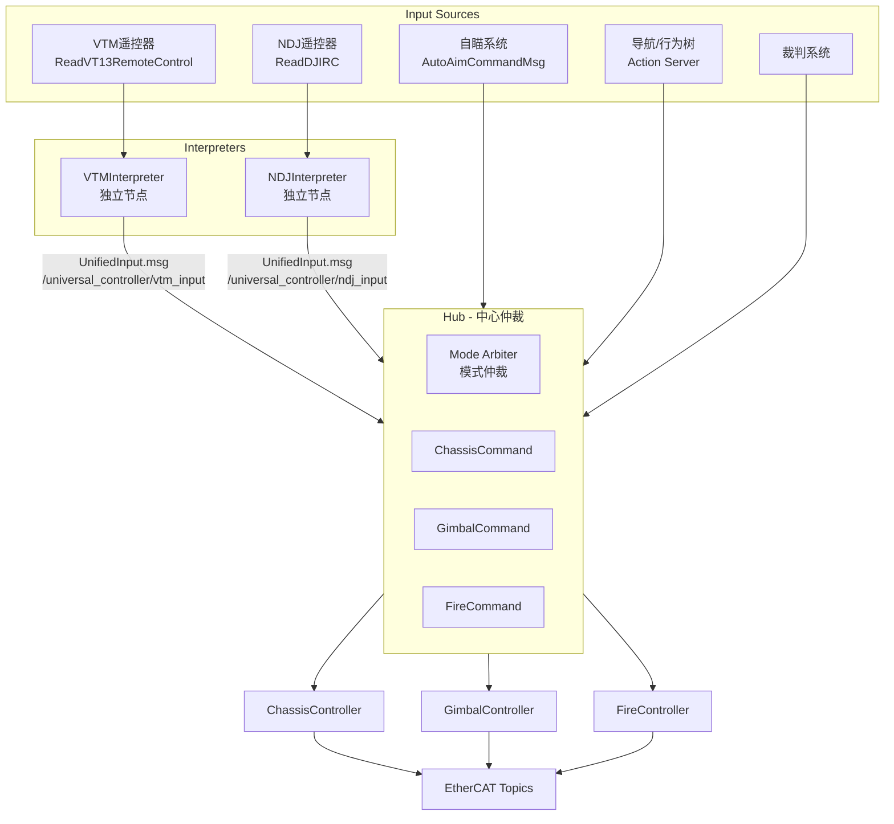

# Universal Controller

通用控制器框架，支持步兵和哨兵机器人的统一控制架构。

## 架构概览

`



## 核心组件

### 1. Interpreters（输入解释器）

两个独立的 ROS2 节点，分别处理不同类型的遥控器：

| Interpreter | 订阅消息 | 连接检测 | 默认话题 |
|-------------|----------|----------|----------|
| **VTMInterpreter** | `ReadVT13RemoteControl` | `online` 字段 | `/ecat/sn4653115/app1/read` |
| **NDJInterpreter** | `ReadDJIRC` | 超时检测 | `/ecat/sn4587585/app1/read` |

两者都发布 `UnifiedInput.msg` 到 Hub。

### 2. InputProcessor（输入处理工具类）

统一的输入处理工具类，处理：

- 摇杆死区和速度映射
- 键盘 + 摇杆组合速度计算
- 小陀螺速度调节（拨轮 + 键盘）
- 鼠标云台控制

### 3. Hub（中心决策）

- 订阅 UnifiedInput.msg（来自 VTM 或 NDJ interpreter）
- 订阅自瞄指令
- 提供 Action Server 供导航/行为树调用
- 模式仲裁和指令分发

### 4. Controllers

| Controller | 功能 | 电机类型 |
|------------|------|----------|
| ChassisController | 舵轮底盘控制 | DJI / LK |
| GimbalController | 云台控制 | Pitch: DJI, Yaw: LK |
| FireController | 发射控制 | DJI |

## ROS2 话题接口

### 订阅 (Subscribers)

| Topic | Msg Type | Source | Purpose |
|-------|----------|--------|---------|
| `/ecat/sn*/app*/read` | ReadDJIRC/ReadVT13RemoteControl | EtherCAT | 遥控器输入 |
| `/ecat/sn*/app*/read` | ReadDJIMotor/ReadLkMotor | EtherCAT | 电机反馈 |
| `/sp_vision/autoaim_command` | AutoAimCommandMsg | 视觉 | 自瞄指令 |
| `/referee/constraints` | Float32MultiArray | 裁判系统 | 功率/热量约束 |
| `/universal_controller/vtm_input` | UnifiedInputMsg | VTMInterpreter | 统一输入 |
| `/universal_controller/ndj_input` | UnifiedInputMsg | NDJInterpreter | 统一输入 |

### 发布 (Publishers)

| Topic | Msg Type | Purpose |
|-------|----------|---------|
| `/ecat/sn*/app*/write` | WriteDJIMotor | DJI 电机指令 |
| `/ecat/sn*/app*/write` | WriteLkMotorTorqueControl | LK 电机指令 |
| `/sp_vision/autoaim_enable` | Bool | 自瞄使能反馈 |

### Action Servers

| Action | Purpose |
|--------|---------|
| `/universal_controller/gimbal_control` | 云台控制（导航/行为树） |
| `/universal_controller/fire_control` | 发射控制（导航/行为树） |

## 消息定义

### UnifiedInput.msg

统一输入消息格式：

```msg
std_msgs/Header header

string control_source      # "VTM" 或 "NDJ"
bool connected             # 遥控器连接状态

# 模式标志
bool emergency_stop        # 急停标志（左拨杆下档）
bool autoaim_enabled       # 自瞄使能（鼠标右键）
bool navigation_enabled    # 导航模式（右拨杆中/上档）

# 底盘指令 (云台坐标系)
float64 vx                 # X方向速度 (前进)
float64 vy                 # Y方向速度 (横移)
float64 wz                 # 旋转角速度
bool spin_mode             # 小陀螺模式
float64 spin_speed         # 小陀螺速度

# 云台指令
float64 pitch_delta        # Pitch 增量 (度)
float64 yaw_delta          # Yaw 增量 (弧度)

# 发射指令
bool fire_trigger          # 发射触发
bool burst_mode            # 连发模式
bool friction_on           # 摩擦轮开关
float64 friction_speed     # 摩擦轮速度

# 速度分档
float64 chassis_speed_scale  # 底盘速度比例 (0-1)
```

### GimbalControl.action

```msg
# Goal
float64 target_yaw_rad
float64 target_pitch_deg
bool track_target
bool relative_mode
float64 timeout_sec
---
# Result
bool success
float64 final_yaw_rad
float64 final_pitch_deg
float64 elapsed_time_sec
---
# Feedback
float64 current_yaw_rad
float64 current_pitch_deg
float64 yaw_error
float64 pitch_error
bool tracking
```

### FireControl.action

```msg
# Goal
uint8 FIRE_MODE_SINGLE = 0
uint8 FIRE_MODE_BURST = 1
uint8 FIRE_MODE_AUTO = 2

bool fire
uint8 fire_mode
uint16 shot_count
float64 duration_sec
float64 friction_speed
---
# Result
bool success
uint16 shots_fired
float64 elapsed_time_sec
string message
---
# Feedback
uint16 shots_fired
uint16 shots_remaining
float64 heat_remaining
bool reloading
bool friction_ready
```

## 模式仲裁

控制模式按以下优先级切换：

1. **EMERGENCY_STOP** (最高)
   - 遥控器离线
   - 左拨杆下档
   - 所有电机停止

2. **NAVIGATION**
   - 导航/行为树 Action 激活
   - 右拨杆中/上档

3. **AUTOAIM**
   - 鼠标右键 + 自瞄有效

4. **MANUAL** (默认)

## 配置

所有配置集中在 `config/controller_params.yaml`：

```yaml
universal_controller:
  ros__parameters:
    control_frequency: 1000
    motor_type:
      chassis: 'DJI'
      gimbal_pitch: 'DJI'
      gimbal_yaw: 'LK'
    chassis:
      wheel_track: 0.372
      wheel_base: 0.372
    gimbal:
      pitch_min_deg: -25.0
      pitch_max_deg: 40.0
    fire:
      friction_speed_default: 6500

vtm_interpreter:
  ros__parameters:
    topic_rc_read: '/ecat/sn4653115/app1/read'
    topic_unified_output: '/universal_controller/vtm_input'

ndj_interpreter:
  ros__parameters:
    topic_rc_read: '/ecat/sn4587585/app1/read'
    topic_unified_output: '/universal_controller/ndj_input'
    connection_timeout_s: 0.5
```

## 电机类型支持

| 组件 | DJI 电机 | LK 电机 |
|------|----------|---------|
| 底盘舵向 | 位置模式 | 级联 PID |
| 底盘驱动 | 速度模式 | 速度 PID |
| 云台 Pitch | 位置模式 | - |
| 云台 Yaw | - | 级联 PID |
| 拨盘 | 串级 PID | - |

## 构建

```bash
cd ~/ros2_ws
colcon build --packages-select universal_controller
source install/setup.bash
```

## 运行

```bash
ros2 launch universal_controller universal_controller.launch.py
```

## 文件结构

```bash
universal_controller/
├── CMakeLists.txt
├── package.xml
├── README.md
├── config/
│   └── controller_params.yaml
├── launch/
│   └── universal_controller.launch.py
├── msg/
│   └── UnifiedInput.msg
├── action/
│   ├── GimbalControl.action
│   └── FireControl.action
├── include/universal_controller/
│   ├── common/
│   │   ├── types.hpp
│   │   └── config.hpp
│   ├── controllers/
│   │   ├── base_controller.hpp
│   │   ├── chassis_controller.hpp
│   │   ├── gimbal_controller.hpp
│   │   └── fire_controller.hpp
│   ├── interpreters/
│   │   ├── vtm_interpreter.hpp
│   │   └── ndj_interpreter.hpp
│   ├── hub/
│   │   └── hub.hpp
│   └── tools/
│       ├── pid.hpp
│       ├── swerve_kinematics.hpp
│       └── input_processor.hpp
├── src/
│   ├── main.cpp
│   ├── hub/
│   │   └── hub.cpp
│   ├── controllers/
│   │   ├── chassis_controller.cpp
│   │   ├── gimbal_controller.cpp
│   │   └── fire_controller.cpp
│   ├── interpreters/
│   │   ├── vtm_interpreter.cpp
│   │   └── ndj_interpreter.cpp
│   └── tools/
│       └── swerve_kinematics.cpp
└── docs/
    └── plan.md
```
