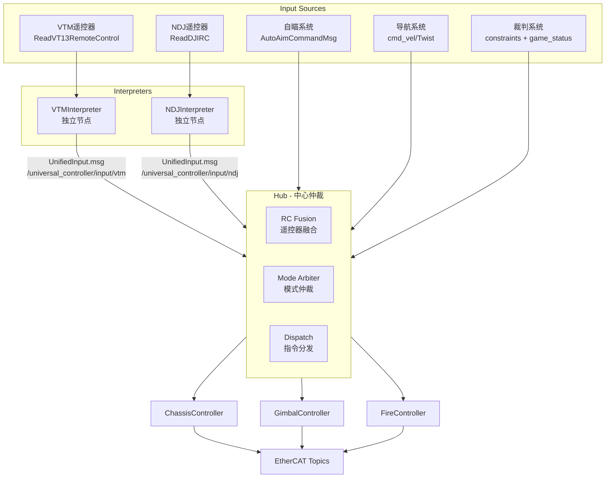

# Universal Controller

通用控制器框架，支持步兵和哨兵机器人的统一控制架构。

## 架构概览



## 核心组件

### 1. Interpreters（输入解释器）

两个独立的 ROS2 节点，分别处理不同类型的遥控器。两者均以 100Hz 定时器发布 `UnifiedInput.msg`。

| Interpreter | 订阅消息 | 连接检测 | 默认话题 |
|-------------|----------|----------|----------|
| **VTMInterpreter** | `ReadVT13RemoteControl` | 超时检测 | `/ecat/sn4653115/vt13/read` |
| **NDJInterpreter** | `ReadDJIRC` | 超时检测 | `/ecat/sn4653115/app1/read` |

两者都发布 `UnifiedInput.msg`，通过 YAML 配置文件定义拨杆停靠点、切换动作、按钮长短按、滚轮动作等。

#### YAML 触发器定义

解释器通过 YAML 配置文件定义遥控器按键/拨杆的行为映射：

- **VTMInterpreter**: 加载 `config/vtm_definition.sentry.yaml`
  - 三档拨杆（急停/正常/导航+行为树）
  - 自定义按钮（自瞄切换、小陀螺、摩擦轮）支持长按/短按检测
  - 滚轮（小陀螺速度调节）
  - 扳机（短按单发、长按连发）

- **NDJInterpreter**: 加载 `config/ndj_definition.sentry.yaml`
  - 左/右拨杆停靠点和切换动作
  - 滚轮动作

动作类型包括三态动作（toggle/force-on/force-off）和小陀螺控制（加速/减速）。

### 2. InputProcessor（输入处理工具类）

Header-only 工具类，提供：

- `process_joystick`: 摇杆死区处理和速度映射
- `compute_chassis_velocity`: 键盘 + 摇杆组合速度计算
- `update_keyboard_speed`: Shift 加速 / Ctrl 减速分档
- `update_spin_speed`: 小陀螺速度调节（拨轮 + 键盘）
- `compute_gimbal_delta`: 鼠标云台控制（灵敏度、增益、限幅）

### 3. Hub（中心决策）

Hub 是系统核心，实现以下功能：

- **RC 融合**: 按优先级融合多个遥控器输入（模拟量通道支持零值穿透）
- **外部输入**: 订阅自瞄指令、导航速度、裁判系统约束和比赛状态
- **模式仲裁**: 独立决定各子系统（底盘/云台/发射）的输入来源
- **指令分发**: 将融合后的指令分发给对应控制器
- **控制循环**: 以 1000Hz 运行主控制循环

Hub 由 4 个源文件组成：

- `hub_core.cpp`: 构造、参数声明、控制循环
- `hub_rc.cpp`: RC 融合逻辑
- `hub_subscribers.cpp`: 外部输入回调（自瞄、导航、裁判）
- `hub_arbitration.cpp`: 模式仲裁和指令分发

### 4. Controllers

所有控制器继承自 `BaseController` 基类，实现 `init()`、`update(dt)`、`stop()` 接口。

| Controller | 功能 | 电机类型 | 关键特性 |
|------------|------|----------|----------|
| ChassisController | 舵轮底盘控制 | DJI / LK | 四轮舵轮运动学、云台-底盘坐标转换、小陀螺速度抑制 |
| GimbalController | 云台控制 | Pitch: DJI, Yaw: LK | IMU 反馈、自瞄集成（Hub 统一下发）、前馈角速度 |
| FireController | 发射控制 | DJI | 三态状态机（IDLE→LOADING→READY）、裁判约束、单发/连发 |

## ROS2 话题接口

### 订阅 (Subscribers)

| Topic | Msg Type | 订阅者 | Purpose |
|-------|----------|--------|---------|
| `/ecat/sn*/vt13/read` | ReadVT13RemoteControl | VTMInterpreter | VTM 遥控器输入 |
| `/ecat/sn*/app*/read` | ReadDJIRC | NDJInterpreter | NDJ 遥控器输入 |
| `/universal_controller/input/vtm` | UnifiedInput | Hub | VTM 统一输入 |
| `/universal_controller/input/ndj` | UnifiedInput | Hub | NDJ 统一输入 |
| `/sp_vision/autoaim_command` | AutoAimCommandMsg | Hub, GimbalController | 自瞄指令 |
| `/cmd_vel` | Twist | Hub | 导航速度指令 |
| `/referee/constraints` | Float32MultiArray | Hub | 功率/热量约束 |
| `/referee/game_status` | GameStatus | Hub | 比赛状态 |
| `/ecat/sn*/app*/read` | ReadDJIMotor/ReadLkMotor/ReadLkMotorMulti | Controllers | 电机反馈 |
| `/ecat/sn*/app*/read` | Imu | GimbalController | IMU 姿态反馈 |

### 发布 (Publishers)

| Topic | Msg Type | 发布者 | Purpose |
|-------|----------|--------|---------|
| `/ecat/sn*/app*/write` | WriteDJIMotor | ChassisController, GimbalController, FireController | DJI 电机指令 |
| `/ecat/sn*/app*/write` | WriteLkMotorBroadcastCurrentControl | ChassisController | LK 舵向/驱动电机电流指令 |
| `/ecat/sn*/app*/write` | WriteLkMotorTorqueControl | GimbalController | LK Yaw 电机力矩指令 |

## 消息定义

### UnifiedInput.msg

统一输入消息格式，由 Interpreter 发布，Hub 订阅：

```msg
std_msgs/Header header

string control_source      # 当前控制源
bool connected             # 遥控器连接状态

# 模式标志
bool emergency_stop        # 急停标志
bool autoaim_enabled       # 自瞄使能
bool navigation_enabled    # 导航模式

# 底盘指令 (云台坐标系)
float64 vx                 # X方向速度 (前进)
float64 vy                 # Y方向速度 (横移)
float64 wz                 # 旋转角速度
bool spin_mode             # 小陀螺模式
float64 spin_speed         # 小陀螺速度

# 云台指令
float64 pitch_delta        # Pitch 增量 (度)
float64 yaw_delta          # Yaw 增量 (弧度)

# 发射指令
bool fire_trigger          # 发射触发
bool burst_mode            # 连发模式
bool friction_on           # 摩擦轮开关
float64 friction_speed     # 摩擦轮速度

# 速度分档
float64 chassis_speed_scale  # 底盘速度比例 (0-1)
```

### AutoAimCommandMsg.msg

自瞄系统指令：

```msg
builtin_interfaces/Time timestamp
bool control
bool shoot
float64 yaw
float64 pitch
```

## 模式仲裁

Hub 对各子系统（底盘/云台/发射）独立进行仲裁，不同子系统可处于不同模式：

| 优先级 | 模式 | 底盘 | 云台 | 发射 |
|--------|------|------|------|------|
| 1 (最高) | EMERGENCY_STOP | 遥控器离线或急停 | 遥控器离线或急停 | 遥控器离线或急停 |
| 2 | NAVIGATION | navigation_enabled + 有效 cmd_vel | - | - |
| 3 | AUTOAIM | - | autoaim_enabled + 有效自瞄指令 | - |
| 4 (默认) | MANUAL | RC 输入 | RC 输入 | RC 输入 |

**仲裁规则**：

- EMERGENCY_STOP：无 UnifiedInput、emergency_stop 标志为真、或遥控器断连时触发，所有电机停止
- NAVIGATION：仅底盘生效，需要 `navigation_enabled` 标志且导航速度在超时窗口内
- AUTOAIM：仅云台生效，需要 `autoaim_enabled` 标志且自瞄指令在超时窗口内
- 发射控制始终来自 RC 输入

**RC 融合**：当多个遥控器同时在线时，按配置优先级（默认 `['vtm', 'ndj']`）选择主输入源。模拟量通道（vx, vy, wz 等）支持零值穿透——高优先级源的摇杆在死区内时，低优先级源可以生效。

## 配置

所有配置集中在 `config/controller_params.yaml`，使用 `/**` 通配符使参数同时作用于所有节点：

```yaml
/**:
  ros__parameters:
    control_frequency: 1000
    autoaim_timeout_s: 0.2
    referee_timeout_s: 0.5

    topics:
      unified_input: '/hub/rc_unified_input'
      autoaim_cmd: '/sp_vision/autoaim_command'
      referee_constraints: '/referee/constraints'
      referee_game_status: '/referee/game_status'

    motor_type:
      chassis: 'LK'           # 'DJI' or 'LK'
      gimbal_pitch: 'DJI'
      gimbal_yaw: 'LK'
      fire_trigger: 'DJI'

    controllers:
      chassis:
        wheel_track: 0.2746
        wheel_base: 0.2746
        ecd_zeros: [5989, 21248, 23534, 1128]
        yaw_center_ecd: 50800
        # ... PID 参数、话题名等

      gimbal:
        pitch_center_ecd: 6050
        pitch_min_deg: -25.0
        pitch_max_deg: 30.0
        # ... Yaw 级联 PID 参数

      fire:
        enabled: true
        friction_speed_default: 6500.0
        shot_period_ms: 50.0
        # ... 拨盘串级 PID 参数

    rc_interpreter:
      topic_vtm_rc: '/ecat/sn4653115/vt13/read'
      topic_ndj_rc: '/ecat/sn4653115/app1/read'
      topic_vtm_output: '/universal_controller/input/vtm'
      topic_ndj_output: '/universal_controller/input/ndj'
      priority: ['vtm', 'ndj']
      # ... 摇杆/键盘/鼠标/小陀螺参数

    rc_hub:
      topic_vtm_input: '/universal_controller/input/vtm'
      topic_ndj_input: '/universal_controller/input/ndj'
      topic_unified_output: '/hub/rc_unified_input'
      priority: ['vtm', 'ndj']
      publish_frequency: 200
```

### 遥控器触发器定义

除主配置外，还有两个 YAML 文件定义遥控器按键映射：

| 文件 | 用途 |
|------|------|
| `config/vtm_definition.sentry.yaml` | VTM 三档拨杆、按钮、滚轮、扳机映射 |
| `config/ndj_definition.sentry.yaml` | NDJ 左/右拨杆、滚轮映射 |

## 电机类型支持

| 组件 | DJI 电机 | LK 电机 |
|------|----------|---------|
| 底盘舵向 | 位置模式（编码器） | 级联 PID（角度环 + 速度环） |
| 底盘驱动 | 速度模式 | 速度环 PID |
| 云台 Pitch | 位置模式（IMU 反馈 + 编码器偏移） | - |
| 云台 Yaw | - | 级联 PID（位置环 + 速度环 + 前馈） |
| 摩擦轮 | 速度模式 | - |
| 拨盘 | 串级 PID（位置环 + 速度环） | - |

**LK 电机编码器范围**：舵轮使用 32768 周期（非 DJI 的 8192），在 `SwerveKinematics` 初始化时根据电机类型自动选择。

## 构建

```bash
cd ~/ros2_ws
colcon build --packages-select universal_controller
source install/setup.bash
```

## 运行

```bash
ros2 launch universal_controller universal_controller.launch.py
```

Launch 参数：

- `config_file`: 配置文件路径（默认为安装目录下的 `config/controller_params.yaml`）
- `robot_type`: 机器人类型（`infantry` / `sentry`，默认 `infantry`）

## 文件结构

```
universal_controller/
├── CMakeLists.txt
├── package.xml
├── README.md
├── config/
│   ├── controller_params.yaml          # 主配置
│   ├── vtm_definition.sentry.yaml      # VTM 遥控器按键映射
│   └── ndj_definition.sentry.yaml      # NDJ 遥控器按键映射
├── launch/
│   └── universal_controller.launch.py
├── msg/
│   ├── UnifiedInput.msg
│   └── AutoAimCommandMsg.msg
├── include/universal_controller/
│   ├── common/
│   │   ├── types.hpp                   # 核心类型定义（ControlMode, Command, RefereeConstraints 等）
│   │   └── config.hpp                  # ConfigLoader + 各控制器 Config 结构体
│   ├── controllers/
│   │   ├── base_controller.hpp         # 控制器抽象基类
│   │   ├── chassis_controller.hpp
│   │   ├── gimbal_controller.hpp
│   │   └── fire_controller.hpp
│   ├── interpreters/
│   │   ├── vtm_interpreter.hpp
│   │   └── ndj_interpreter.hpp
│   ├── hub/
│   │   └── hub.hpp
│   └── tools/
│       ├── pid.hpp                     # PID + CascadePID
│       ├── swerve_kinematics.hpp       # 舵轮运动学解算
│       ├── input_processor.hpp         # 输入处理工具
│       ├── rc_action_types.hpp         # 遥控器动作类型定义
│       └── rc_yaml_parser.hpp          # 遥控器 YAML 配置解析
└── src/
    ├── main.cpp                        # 入口：创建所有节点，MultiThreadedExecutor
    ├── hub/
    │   ├── hub_core.cpp                # Hub 构造、参数、控制循环
    │   ├── hub_rc.cpp                  # RC 融合逻辑
    │   ├── hub_subscribers.cpp         # 外部输入回调
    │   └── hub_arbitration.cpp         # 模式仲裁和指令分发
    ├── controllers/
    │   ├── chassis_controller.cpp
    │   ├── gimbal_controller.cpp
    │   └── fire_controller.cpp
    ├── interpreters/
    │   ├── vtm_interpreter.cpp
    │   └── ndj_interpreter.cpp
    └── tools/
        ├── swerve_kinematics.cpp
        └── rc_yaml_parser.cpp
```

## 依赖

- `rclcpp` — ROS2 C++ 客户端库
- `custom_msgs` — 自定义 EtherCAT 电机消息（ReadDJIMotor, WriteDJIMotor, ReadLkMotor 等）
- `sp_msgs` — 视觉系统消息（AutoAimCommandMsg）
- `dji_referee_protocol` — 裁判系统协议
- `sensor_msgs` — IMU 消息
- `geometry_msgs` — Twist 消息
- `yaml-cpp` — YAML 配置解析
