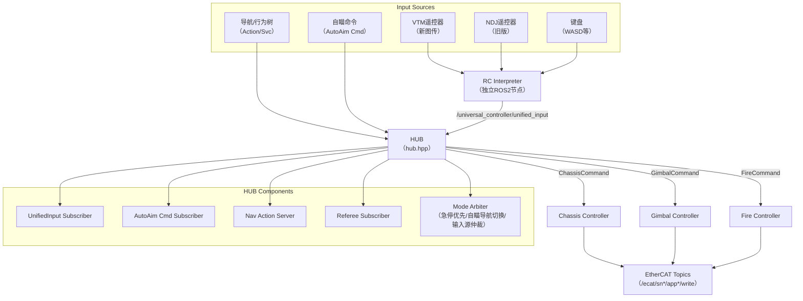

# Universal Controller Framework Implementation Plan

## Context

重构 `universal_controller_framework` 为统一的 C++ 控制器框架，整合 `infantry_controller` 和 `sentry_controller` 的功能。

**目标：**

1. 将 Python 控制器重构为 C++ 版本
2. 实现 Hub 统一入口，协调 interpreter 和 controllers
3. 统一配置，避免重复项
4. 支持多输入源（遥控器、键盘、自瞄、导航/行为树）
5. **支持 DJI 和 LK 两种电机类型（通过配置选择）**
6. **独立 RC Interpreter 节点，统一消息格式**
7. **支持 Action/Service 用于导航/行为树控制云台和火控**

## Architecture Overview



## Key Files to Create/Modify

### 1. Custom Messages (msg/)

| File | Purpose |
|------|---------|
| `msg/UnifiedInput.msg` | 统一输入消息格式（RC/键盘/导航） |
| `msg/ControllerCommand.msg` | 控制器指令（底盘/云台/发射） |

### 2. Custom Actions (action/)

| File | Purpose |
|------|---------|
| `action/GimbalControl.action` | 云台控制 Action（导航/行为树使用） |
| `action/FireControl.action` | 发射控制 Action |

### 3. Core Headers (include/universal_controller_framework/)

| File | Purpose |
|------|---------|
| `hub/hub.hpp` | 中心决策 Hub，模式仲裁，指令分发 |
| `controllers/chassis_controller.hpp` | 底盘控制器（支持 DJI/LK） |
| `controllers/gimbal_controller.hpp` | 云台控制器 |
| `controllers/fire_controller.hpp` | 发射控制器 |
| `controllers/base_controller.hpp` | 控制器基类 |
| `interpreters/rc_interpreter.hpp` | 统一输入解析节点 |
| `interpreters/vtm_interpreter.hpp` | VTM 遥控器解析 |
| `interpreters/ndj_interpreter.hpp` | NDJ 遥控器解析 |
| `interpreters/kbd_interpreter.hpp` | 键盘解析 |
| `tools/pid.hpp` | PID 控制器 |
| `tools/swerve_kinematics.hpp` | 舵轮运动学 |
| `common/types.hpp` | 通用类型定义 |
| `common/config.hpp` | 配置加载 |

### 4. Source Files (src/)

| File | Purpose |
|------|---------|
| `main.cpp` | ROS2 节点入口 |
| `rc_interpreter_node.cpp` | 独立 RC Interpreter 节点入口 |
| `hub/hub.cpp` | Hub 实现 |
| `controllers/chassis_controller.cpp` | 底盘控制实现 |
| `controllers/gimbal_controller.cpp` | 云台控制实现 |
| `controllers/fire_controller.cpp` | 发射控制实现 |
| `interpreters/rc_interpreter.cpp` | 统一输入解析实现 |
| `tools/pid.cpp` | PID 实现 |
| `tools/swerve_kinematics.cpp` | 运动学实现 |

### 5. Configuration

| File | Purpose |
|------|---------|
| `config/controller_params.yaml` | 统一参数配置 |
| `launch/universal_controller.launch.py` | 启动文件 |

---

## Implementation Details

### Phase 1: Custom Messages & Actions

#### 1.1 UnifiedInputMsg (`msg/UnifiedInput.msg`)

```raw
# 统一输入消息格式 - 所有输入源都转换为此格式
std_msgs/Header header

# ===== 模式标志 =====
uint8 control_source      # 0=RC, 1=KEYBOARD, 2=NAVIGATION, 3=BEHAVIOR_TREE
bool emergency_stop       # 急停标志
bool autoaim_enabled      # 自瞄使能
bool navigation_enabled   # 导航模式

# ===== 底盘指令 =====
float64 vx                # X方向速度 (云台系)
float64 vy                # Y方向速度 (云台系)
float64 wz                # 旋转角速度
bool spin_mode            # 小陀螺模式
float64 spin_speed        # 小陀螺速度

# ===== 云台指令 =====
float64 pitch_delta       # Pitch 增量 (度)
float64 yaw_delta         # Yaw 增量 (弧度)
float64 target_pitch      # 目标 Pitch (度) - 导航用
float64 target_yaw        # 目标 Yaw (弧度) - 导航用

# ===== 发射指令 =====
bool fire_trigger         # 发射触发
bool burst_mode           # 连发模式
bool friction_on          # 摩擦轮开关
float64 friction_speed    # 摩擦轮速度

# ===== 原始 RC 数据 (用于调试) =====
uint8 left_switch         # 左拨杆: 1=Up, 2=Down, 3=Mid
uint8 right_switch        # 右拨杆
float64 dial              # 拨轮值
```

#### 1.2 GimbalControl Action (`action/GimbalControl.action`)

```raw
# Goal
float64 target_yaw_rad
float64 target_pitch_deg
bool track_target         # 是否持续跟踪
bool relative_mode        # true=相对模式, false=绝对模式
---
# Result
bool success
float64 final_yaw_rad
float64 final_pitch_deg
---
# Feedback
float64 current_yaw_rad
float64 current_pitch_deg
float64 yaw_error
float64 pitch_error
```

#### 1.3 FireControl Action (`action/FireControl.action`)

```raw
# Goal
bool fire                 # 发射
uint8 fire_mode           # 0=SINGLE, 1=BURST, 2=AUTO
uint16 shot_count         # 发射数量（单发/连发模式用）
float64 duration          # 持续时间（自动模式用）
---
# Result
bool success
uint16 shots_fired
---
# Feedback
uint16 shots_fired
float64 heat_remaining
bool reloading
```

### Phase 2: RC Interpreter (独立节点)

#### 2.1 RC Interpreter 职责

1. **订阅所有输入源**：
   - VTM 遥控器 (`/ecat/sn*/app1/read` → ReadDJIRC)
   - NDJ 遥控器 (自定义话题)
   - 键盘输入 (`/keyboard_input`)
2. **解析并转换为统一格式**：
   - 摇杆 → vx, vy, wz
   - 拨杆 → 模式标志
   - 键盘 WASD → vx, vy
   - 键盘 V → spin_mode
   - 鼠标 → pitch_delta, yaw_delta
3. **发布统一消息**：
   - Topic: `/universal_controller/unified_input`
   - Msg: `UnifiedInputMsg`

#### 2.2 RC Interpreter 接口

```cpp
class RCInterpreter : public rclcpp::Node {
public:
    RCInterpreter();
private:
    // Subscribers for different input sources
    rclcpp::Subscription<ReadDJIRC>::SharedPtr sub_vtm_rc_;
    rclcpp::Subscription<...>::SharedPtr sub_ndj_rc_;
    rclcpp::Subscription<...>::SharedPtr sub_keyboard_;

    // Publisher for unified output
    rclcpp::Publisher<UnifiedInputMsg>::SharedPtr pub_unified_;

    // Internal state
    UnifiedInputMsg current_state_;
    void process_vtm_rc(const ReadDJIRC::SharedPtr msg);
    void process_ndj_rc(...);
    void process_keyboard(...);
    void publish_unified();
};
```

### Phase 3: Core Infrastructure

#### 3.1 Common Types (`common/types.hpp`)

```cpp
enum class ControlMode {
    EMERGENCY_STOP = 0,
    MANUAL = 1,
    AUTOAIM = 2,
    NAVIGATION = 3,
    BEHAVIOR_TREE = 4
};

enum class MotorType { DJI, LK };

struct ChassisCommand {
    double vx_gimbal;
    double vy_gimbal;
    double wz;
    bool spin_mode;
    double spin_speed;
};

struct GimbalCommand {
    double pitch_deg;
    double yaw_rad;
    bool autoaim_enabled;
    bool from_action;  // true if from Action Server
};

struct FireCommand {
    bool friction_on;
    bool trigger_fire;
    bool burst_mode;
    double friction_speed;
};
```

#### 3.2 PID Controller (`tools/pid.hpp`)

参考 Python 版本实现：

- KP, KI, KD 参数
- 积分限幅、输出限幅
- D 项低通滤波
- 动态参数更新（ROS2 参数回调）

#### 3.3 Swerve Kinematics (`tools/swerve_kinematics.hpp`)

参考 `infantry_controller/chassis_kinematics.py`：

- 四轮舵轮运动学解算
- 最短路径优化
- 支持 8192（DJI）和 65536（LK）编码器

### Phase 4: Controllers

#### 4.1 Base Controller Interface

```cpp
class BaseController {
public:
    virtual void init(rclcpp::Node* node, const std::string& prefix) = 0;
    virtual void update(double dt) = 0;
    virtual void stop() = 0;
    virtual ~BaseController() = default;
};
```

#### 4.2 Chassis Controller（支持 DJI/LK）

```cpp
class ChassisController : public BaseController {
public:
    void set_command(const ChassisCommand& cmd);
    void set_motor_type(MotorType type);  // DJI or LK

private:
    MotorType motor_type_;
    // DJI 模式：位置控制
    // LK 模式：级联 PID（角度环+速度环）

    std::array<PID, 4> steer_angle_pids_;  // LK only
    std::array<PID, 4> steer_speed_pids_;  // LK only
    std::array<PID, 4> drive_speed_pids_;  // Both

    SwerveKinematics kinematics_;
};
```

#### 4.3 Gimbal Controller

- 支持 Action Server 接收导航指令
- Pitch: DJI 电机位置控制
- Yaw: LK 电机级联 PID
- 自瞄/手动模式切换

#### 4.4 Fire Controller

- 支持 Action Server 接收发射指令
- 状态机：IDLE → LOADING → READY
- 串级 PID 拨盘控制
- 裁判系统约束

### Phase 5: Hub

#### 5.1 Hub 模式仲裁逻辑

```cpp
ControlMode Hub::arbitrate_mode(
    const UnifiedInputMsg& rc_input,
    const AutoAimCommandMsg::SharedPtr& autoaim,
    const bool nav_action_active) {

    // 1. 急停优先级最高
    if (rc_input.emergency_stop) {
        return ControlMode::EMERGENCY_STOP;
    }

    // 2. 导航/行为树 Action 优先
    if (nav_action_active && rc_input.navigation_enabled) {
        return ControlMode::NAVIGATION;
    }

    // 3. 自瞄模式（左拨杆上档 + 自瞄有效）
    if (rc_input.autoaim_enabled && autoaim && autoaim->control) {
        return ControlMode::AUTOAIM;
    }

    // 4. 默认手动模式
    return ControlMode::MANUAL;
}
```

#### 5.2 Hub Action Servers

```cpp
// 云台控制 Action Server
rclcpp_action::Server<GimbalControl>::SharedPtr gimbal_action_server_;

// 发射控制 Action Server
rclcpp_action::Server<FireControl>::SharedPtr fire_action_server_;

// 回调处理
rclcpp_action::GoalResponse handle_gimbal_goal(
    const std::shared_ptr<const GimbalControl::Goal> goal);
```

#### 5.3 Hub Input Sources

```cpp
class Hub : public rclcpp::Node {
private:
    // Subscribers
    rclcpp::Subscription<UnifiedInputMsg>::SharedPtr sub_unified_input_;
    rclcpp::Subscription<AutoAimCommandMsg>::SharedPtr sub_autoaim_;
    rclcpp::Subscription<Float32MultiArray>::SharedPtr sub_referee_;

    // Action Servers
    rclcpp_action::Server<GimbalControl>::SharedPtr gimbal_action_server_;
    rclcpp_action::Server<FireControl>::SharedPtr fire_action_server_;

    // Controllers
    std::unique_ptr<ChassisController> chassis_;
    std::unique_ptr<GimbalController> gimbal_;
    std::unique_ptr<FireController> fire_;

    // State
    ControlMode current_mode_;
    UnifiedInputMsg rc_state_;
    AutoAimCommandMsg::SharedPtr autoaim_state_;
    bool nav_active_ = false;
};
```

### Phase 6: Configuration

#### 6.1 Unified YAML Structure

```yaml
universal_controller:
  ros__parameters:
    # === 全局配置 ===
    control_frequency: 1000
    autoaim_timeout_s: 0.2
    referee_timeout_s: 0.5

    # === 话题配置 ===
    topic_unified_input: '/universal_controller/unified_input'
    topic_rc_read: '/ecat/sn4587585/app1/read'
    topic_imu_read: '/ecat/sn4653090/app2/read'
    topic_autoaim_cmd: '/sp_vision/autoaim_command'
    topic_referee_constraints: '/referee/constraints'

    # === 电机类型配置 ===
    motor_type:
      chassis: 'DJI'      # 'DJI' or 'LK'
      gimbal_pitch: 'DJI'
      gimbal_yaw: 'LK'
      fire_trigger: 'DJI'

    # === 底盘配置 ===
    chassis:
      wheel_track: 0.372
      wheel_base: 0.372
      ecd_zeros: [7411, 7530, 3419, 2051]
      topic_drive_write: '/ecat/sn4587586/app1/write'
      topic_steer_write: '/ecat/sn4587586/app2/write'
      topic_yaw_read: '/ecat/sn4587586/app3/read'
      spin_speed_default: 3000.0
      spin_speed_min: 800.0
      spin_speed_max: 6500.0
      # LK motor PIDs (only used if motor_type == 'LK')
      steer_angle_pid: [0.3, 0.0, 0.0, 150.0, 300.0]
      steer_speed_pid: [5.5, 0.0, 3.3, 850.0, 500.0]
      drive_speed_pid: [6.0, 0.3, 0.0, 2000.0, 250.0]

    # === 云台配置 ===
    gimbal:
      pitch_center_ecd: 4600
      pitch_min_deg: -25.0
      pitch_max_deg: 40.0
      mouse_sensitivity: 1.0
      topic_pitch_write: '/ecat/sn4587585/app4/write'
      topic_pitch_read: '/ecat/sn4587585/app4/read'
      topic_yaw_write: '/ecat/sn4587586/app3/write'
      topic_yaw_read: '/ecat/sn4587586/app3/read'
      # Yaw cascade PID
      yaw_pos_kp: 20.0
      yaw_pos_ki: 0.0
      yaw_pos_kd: 0.5
      yaw_spd_kp: 220.0
      yaw_spd_ki: 0.3
      yaw_spd_kd: 4600.0

    # === 发射配置 ===
    fire:
      enabled: true
      friction_speed_default: 6500
      shot_period_ms: 30.0
      load_current_threshold: 500
      load_speed_ecd: 2.5
      topic_fire_write: '/ecat/sn4587585/app3/write'
      topic_fire_read: '/ecat/sn4587585/app3/read'
      # Trigger cascade PID
      trigger_pos_pid: [0.4, 0.0, 7.0, 13000.0, 1500.0]
      trigger_spd_pid: [5.0, 0.01, 0.0, 10000.0, 1000.0]

# RC Interpreter 节点配置
rc_interpreter:
  ros__parameters:
    topic_vtm_rc: '/ecat/sn4587585/app1/read'
    topic_ndj_rc: '/ecat/ndj_rc'
    topic_keyboard: '/keyboard_input'
    topic_unified_output: '/universal_controller/unified_input'
    input_source: 'VTM'  # 'VTM', 'NDJ', or 'KEYBOARD'
```

### Phase 7: Launch & Build

#### 7.1 CMakeLists.txt Updates

```cmake
# 添加自定义消息依赖
find_package(rosidl_default_generators REQUIRED)
rosidl_generate_interfaces(${PROJECT_NAME}
  "msg/UnifiedInput.msg"
  "action/GimbalControl.action"
  "action/FireControl.action"
)

# 添加源文件
add_executable(rc_interpreter_node
  src/rc_interpreter_node.cpp
  src/interpreters/rc_interpreter.cpp
)
ament_target_dependencies(rc_interpreter_node
  rclcpp custom_msgs geometry_msgs std_msgs
)

add_executable(universal_controller_node
  src/main.cpp
  src/hub/hub.cpp
  src/controllers/chassis_controller.cpp
  src/controllers/gimbal_controller.cpp
  src/controllers/fire_controller.cpp
  src/tools/pid.cpp
  src/tools/swerve_kinematics.cpp
)
ament_target_dependencies(universal_controller_node
  rclcpp custom_msgs sp_msgs sensor_msgs geometry_msgs std_msgs
  rclcpp_action
)
```

#### 7.2 Launch File

```python
# launch/universal_controller.launch.py
def generate_launch_description():
    return LaunchDescription([
        # RC Interpreter Node
        Node(
            package='universal_controller',
            executable='rc_interpreter_node',
            name='rc_interpreter',
            parameters=[config_file],
            output='screen'
        ),
        # Main Controller Node
        Node(
            package='universal_controller',
            executable='universal_controller_node',
            name='universal_controller',
            parameters=[config_file],
            output='screen'
        )
    ])
```

---

## ROS2 Topics & Interfaces Summary

### Input Topics (订阅)

| Topic | Msg Type | Source | Purpose |
|-------|----------|--------|---------|
| `/ecat/sn*/app*/read` | ReadDJIRC/ReadLkMotor | EtherCAT | 电机反馈、遥控器 |
| `/sp_vision/autoaim_command` | AutoAimCommandMsg | 视觉 | 自瞄指令 |
| `/referee/constraints` | Float32MultiArray | 裁判系统 | 功率/热量约束 |
| `/referee/game_status` | String | 裁判系统 | 比赛状态 |
| `/universal_controller/unified_input` | UnifiedInputMsg | RC Interpreter | 统一输入 |

### Output Topics (发布)

| Topic | Msg Type | Purpose |
|-------|----------|---------|
| `/ecat/sn*/app*/write` | WriteDJIMotor | DJI 电机指令 |
| `/ecat/sn*/app*/write` | WriteLkMotorTorqueControl | LK 电机指令 |
| `/sp_vision/autoaim_enable` | Bool | 自瞄使能反馈 |

### Action Servers

| Action | Purpose |
|--------|---------|
| `/universal_controller/gimbal_control` | 云台控制（导航/行为树） |
| `/universal_controller/fire_control` | 发射控制（导航/行为树） |

---

## Verification

1. **编译测试**：`colcon build --packages-select universal_controller`
2. **消息测试**：验证 UnifiedInputMsg 发布正确
3. **Action 测试**：
   - 调用 GimbalControl Action，验证云台响应
   - 调用 FireControl Action，验证发射响应
4. **模式切换测试**：
   - 急停 → 所有电机停止
   - 遥控 → 自瞄 → 导航 模式切换
5. **电机类型测试**：
   - 配置 DJI 模式，验证位置控制
   - 配置 LK 模式，验证级联 PID

---

## File List Summary

### Create (新建)

1. `msg/UnifiedInput.msg`
2. `action/GimbalControl.action`
3. `action/FireControl.action`
4. `include/.../common/types.hpp`
5. `include/.../common/config.hpp`
6. `include/.../tools/pid.hpp`
7. `include/.../tools/swerve_kinematics.hpp`
8. `include/.../controllers/base_controller.hpp`
9. `src/main.cpp`
10. `src/rc_interpreter_node.cpp`
11. `src/hub/hub.cpp`
12. `src/interpreters/rc_interpreter.cpp`
13. `src/controllers/*.cpp`
14. `src/tools/*.cpp`
15. `launch/universal_controller.launch.py`
16. `README.md`

### Fill Content (填充内容)

1. `hub/hub.hpp`
2. `controllers/*.hpp`
3. `interpreters/*.hpp`
4. `config/controller_params.yaml`

### Modify (修改)

1. `CMakeLists.txt`
2. `package.xml`
